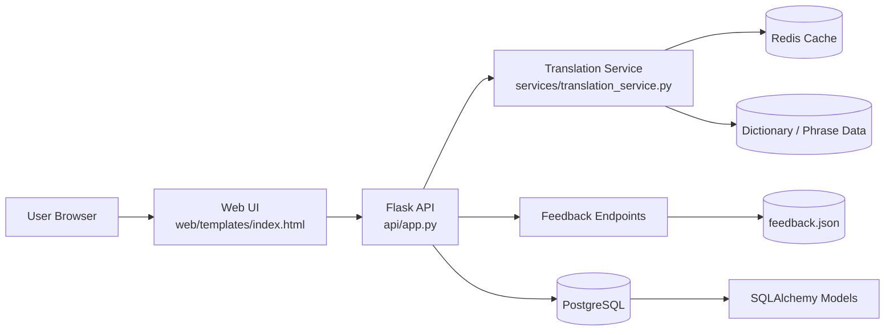

# English to Limbu Translation System

## Quick Start

Run everything with one command:

```bash
bash setup.sh
```

Or use Make targets:

```bash
make install
make run
make test
make deploy
```

## Project Overview

This project provides a dictionary-first English to Limbu translation platform with:

- a Flask API for translation, dictionary search, and feedback collection
- a Tailwind-based web interface
- Redis-backed caching in the translation service
- SQLAlchemy models for translation history, dictionary content, and feedback workflows
- Dockerized local/production deployment support

The system is designed to start simple and grow toward ML-assisted translation over time.

## Architecture Diagram



## Features

- Dictionary translation for words, common phrases, and simple sentences
- Fuzzy matching fallback for misspelled input
- Basic ML prediction stub for future model integration
- Rate-limited translation API endpoint
- Feedback collection with JSON persistence
- Database bootstrap and seed tooling
- Automated test suite with pytest

## Project Structure

```text
api/                Flask app and endpoints
config/             Settings and database config
models/             SQLAlchemy models
services/           Business logic (translation, feedback, validation)
web/templates/      Frontend templates
scripts/            Deployment, DB initialization, backups
tests/              pytest suite
main.py             CLI entry point
```

## Installation

### 1) Clone and create virtual environment

```bash
git clone <your-repo-url>
cd english_to_limbu_translation_system
python -m venv .venv
source .venv/bin/activate  # Linux/macOS
# .venv\Scripts\activate    # Windows (PowerShell)
```

### 2) Install dependencies

```bash
pip install -r requirements.txt
```

### 3) Configure environment

```bash
cp .env.example .env
```

Update values in `.env` as needed (database URL, Redis URL, debug mode, API port).

### 4) Initialize database

```bash
python main.py init-db
```

### 5) Run application

Development:

```bash
python main.py run-dev
```

Production (Gunicorn):

```bash
python main.py run-prod
```

## API Documentation (Quick)

Base URL (local): `http://localhost:5000`

- `GET /`  
  Serves the web UI.

- `POST /api/translate`  
  Translate text from English to Limbu.

- `GET /api/dictionary/search?q=<query>`  
  Search dictionary entries by partial English match.

- `POST /api/feedback`  
  Submit user feedback/suggestions.

- `GET /api/feedback`  
  Retrieve submitted feedback list.

Full endpoint details: see `API_DOCS.md`.

## Usage Examples

### Translate text

```bash
curl -X POST http://localhost:5000/api/translate \
  -H "Content-Type: application/json" \
  -d '{"text":"hello water"}'
```

### Search dictionary

```bash
curl "http://localhost:5000/api/dictionary/search?q=thank"
```

### Submit feedback

```bash
curl -X POST http://localhost:5000/api/feedback \
  -H "Content-Type: application/json" \
  -d '{"english":"hello","suggested_limbu":"sewaro","comment":"Looks correct"}'
```

## Running Tests

```bash
pytest
```

Current suite includes:

- translation service tests
- API endpoint tests (including rate limit behavior)
- feedback flow tests

## Docker

Build and run full stack:

```bash
docker compose up --build
```

Use deployment script:

```bash
bash scripts/deploy.sh
```

## Contribution Guidelines

1. Fork and create a feature branch.
2. Keep changes focused and include tests.
3. Run checks before opening PR:
   - `pytest`
   - basic app startup (`python main.py run-dev`)
4. Use clear commit messages that explain intent.
5. Open a pull request with:
   - summary
   - test evidence
   - any migration/deployment notes
